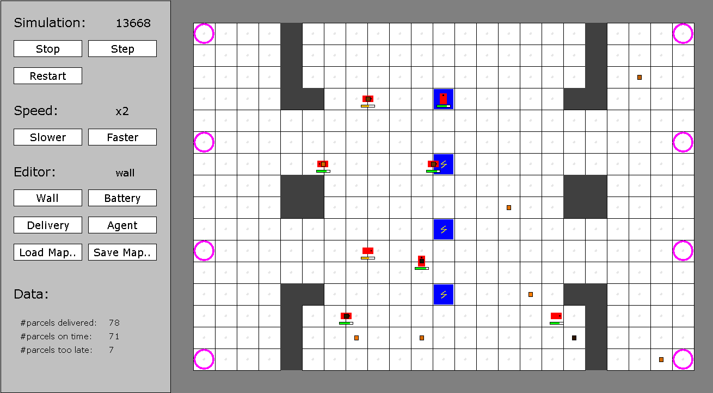

# Multi-Agent System

A multi-agent system written in Java for a university course called "Multi-Agent Systems".

Automated Guided Vehicles (AGVs) operate in a "warehouse" setting. They pick up parcels and deliver them to the associated delivery locations. Each AGV has a battery that discharges when the agent moves around. In order to avoid complete battery depletion, AGVs need to recharge their battery by using charging stations. Different battery charging strategies are tested.

## Screenshot

